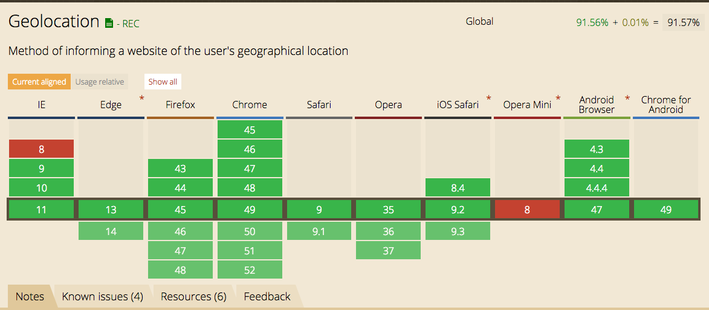
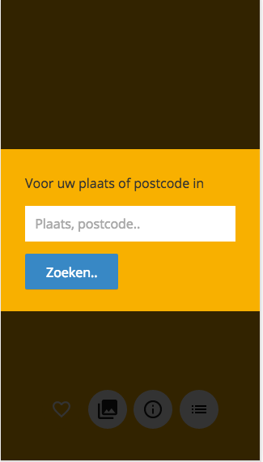
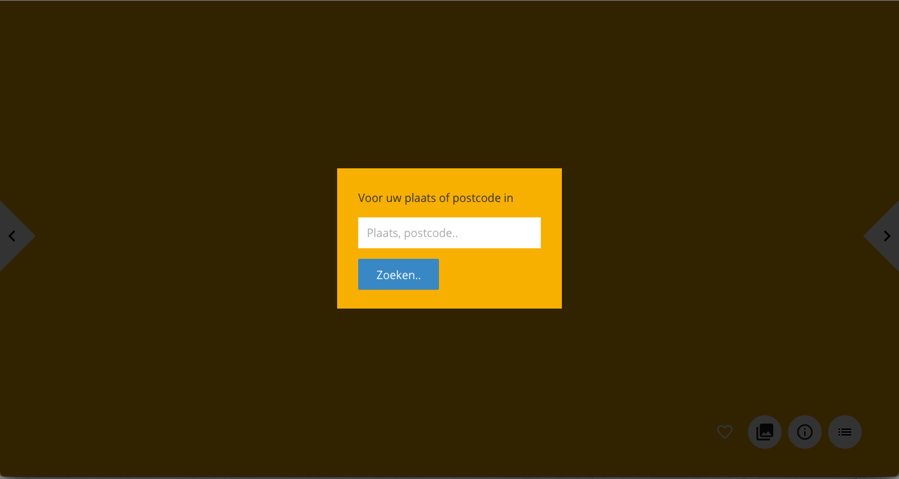

# Funda app

## Getting started

* Step 1 - clone the repo

* Step 2 - install dependencies

```
npm install
```

* Step 3 - running the server

Run a gulp server it will automatically open a new window with [http://localhost:3000](http://localhost:3000) in your browser.
```
gulp server
```
Gulp will make an /build folder.

# Core functionality of my Funda app
* The core functionality of the app is Geolocation, it will show houses based on your current location.
* The function of geolocation was fired immediately after the page was loading without checking if geolocation was supported. So I changed it to a input box (read below).

## Feature: Geolocation 
* The Geolocation on the funda app gets your coordinates and sends them to the google api to retrieve your postal and city. 
* After this it sends the city and postal to the Funda Api to retrieve houses nearby.

### Can I use?


### Fallback
* If the Geolocation is supported it will immediately make a API call and retrieve houses nearby.
* The Funda app will show an input field where the user can type his city or postal if the Geolocation is blocked or not supported
* Javascript uses a feature detection do determine if the geolocation is supported.
* The navigator.geolocations takes an error fallback as second argument.

### Link to new funda app with fallback
* [Link to new funda app](http://funda-fallback.dylanvens.com)

```javascript
gApi.getLongLang = function(callback, error) {
	
	// If geolocation is true (supported)
	if(navigator.geolocation) {
		
		// If geolocation is supported use the callback, if geolocation is blocked it will call the fallback
		var _location = navigator.geolocation.getCurrentPosition(callback, fallback);

	} else {
		
		// If geolocation is not supported show input field.
		fallback();
		console.log('Geolocation is not supported in this browser');

	}

}
```

```javascript
overview.getLongLang = function() {

	var _this = this;

	gapi.getLongLang(function(position){

		// Callback if geolocation is supported
		var _position = {
			lat: position.coords.latitude,
			lng: position.coords.longitude
		};

		_this.getLocation(_position);

	}, function(){
		
		// Fallback if geolocation is blocked or not supported
		_this.showForm();

	});

}
```

```javascript
var _geoForm = Ld('.geolocation');
var _geoSubmit = Ld('.geolocation__submit-btn');
var _geoInput = document.querySelector('.geolocation__search');

overview.showForm = function() {

	var _this = this;

	_geoForm.addClass('is-active');

	_geoSubmit.addListener('click', function(e){

		_this.loadData(_geoInput.value, 'no-geo');
		_geoForm.removeClass('is-active');

		e.preventDefault();
	});

}
```

## Fallback Mobile and Desktop



