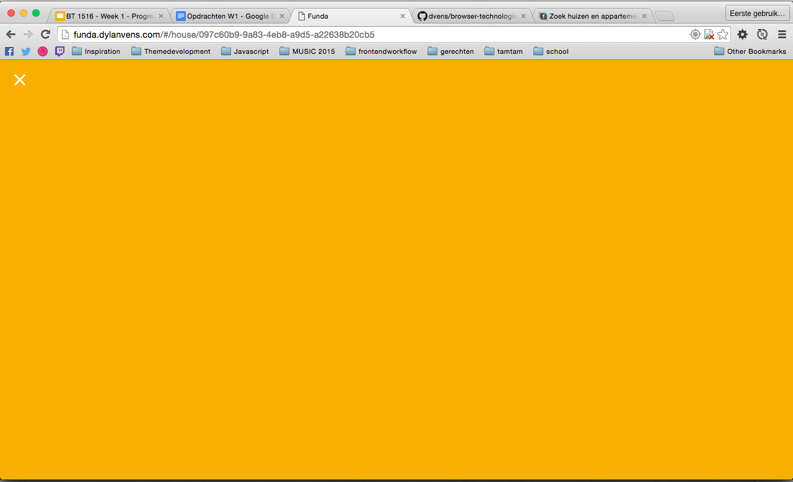
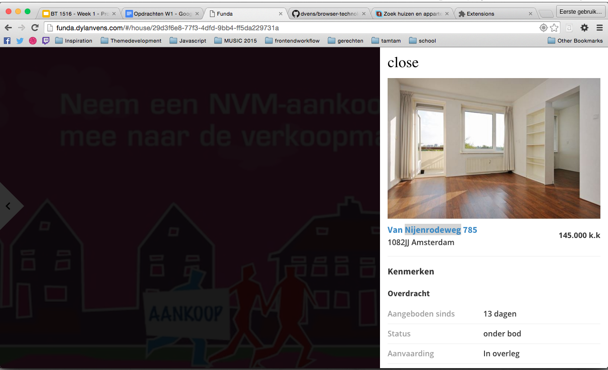
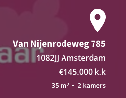
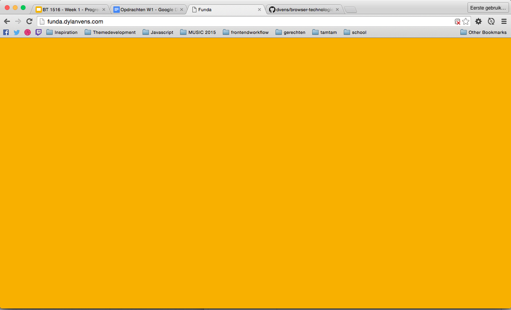
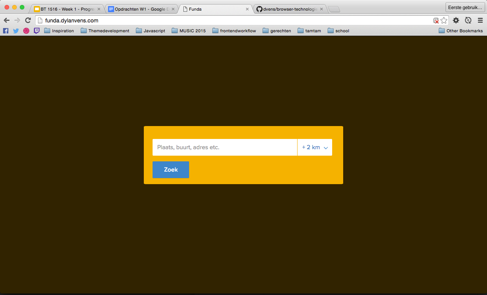
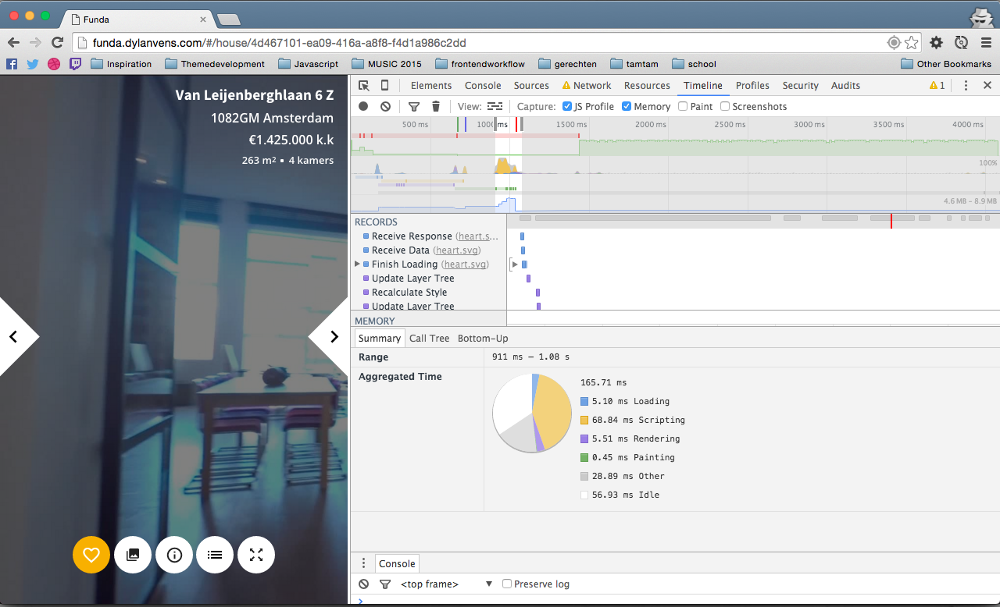
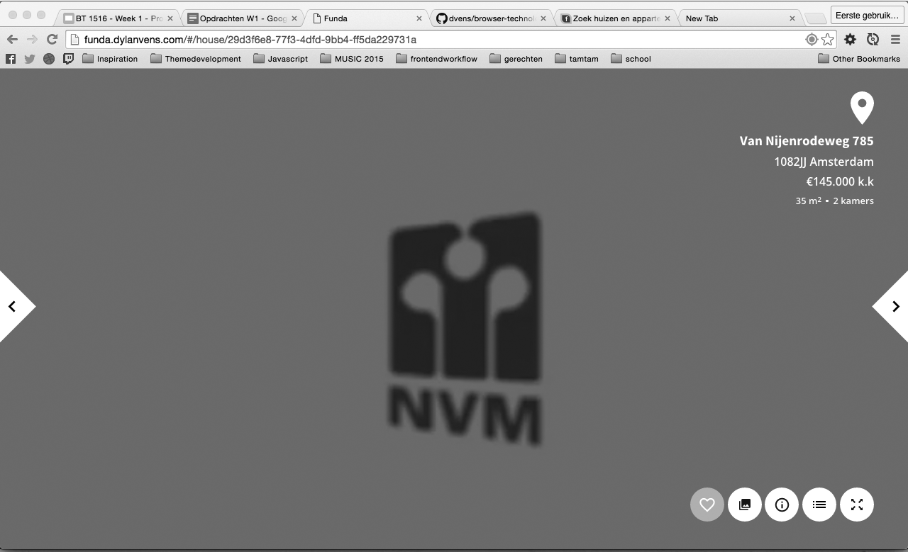
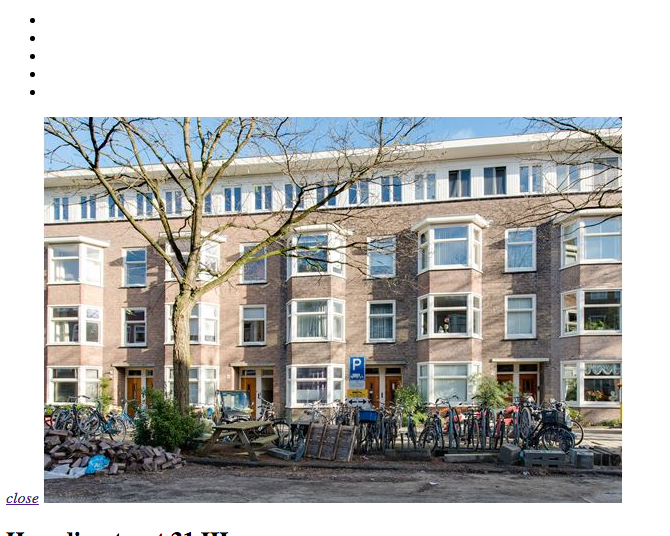

# LookLive server

## Getting started

* Step 1 - clone the repo

* Step 2 - install dependencies

```
npm install
```

* Step 3 - running the server

Run a gulp server it will automatically open a new window with [http://localhost:3000](http://localhost:3000) in your browser.
```
gulp server
```
Gulp will make an /build folder.

# Disabled Web Features

## List of things that I have changed
- Changed the main buttons to svg instead of css backgrounds.
- Added fallback fonts for Open Sans, Source Sans Pro.
- Added Aria-labels for text to speech.
- Added focus on elements to tab through easily.

## Disabled images
* Images are not shown when disabled, the concept of the app is running on a video background (still working).
* Main buttons to navigate through the page are not shown.

### Gallery no images 

> Solution: none the website is running on images (or alt text but it is useless).

### Main buttons not shown 

> Solution: changed the icons to inline svgs

## Custom fonts
* Icon fonts do not work and swapped by text
* Custom fonts like Open Sans are changed to serif.

### Icon fonts 


### Custom fonts

> Solution: Added fallback fonts

## No Javascript
* Nothing is loading because the pages are rendered by Javascript


> Solution: Server side html parsing (and page animation only with Javascript) or a no-script tag 

* Geolocation not working


> Solution: Add an input field to let the user give his location

## Internet Access
* throttling: regular 4g (4mb/s 20ms RTT)
* first paint: 668ms
* domcontentloaded: 718ms
* load event: 1.06s



## Color
* No problems at all :)



## No CSS
* Icons not shown without css



> Solution: Changed to inline svg

## No influence at all on my website
* Javascript Wifi Hotspots
* Javascript content blockers
* Localstorage
* CDN's
* Ad Blockers
* Cookies